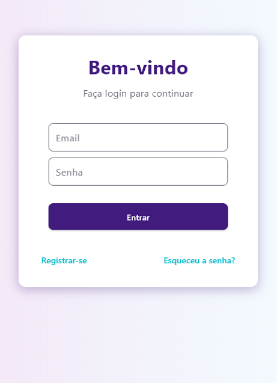
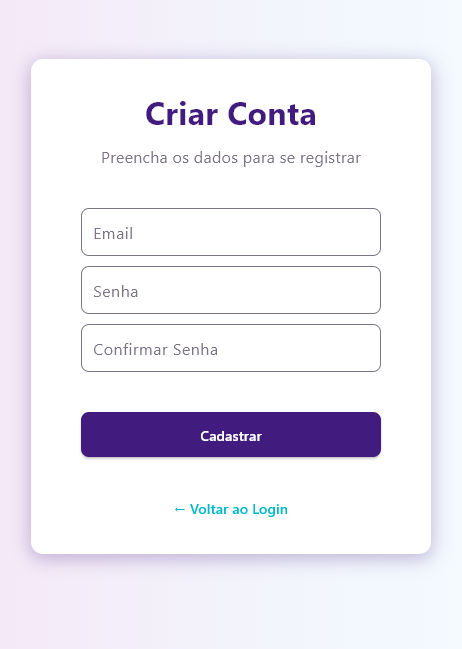
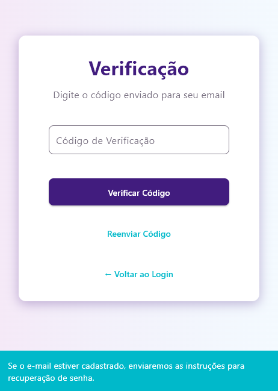

# Sistema de Autenticação com Flet e FastAPI

Aplicação de login com recuperação de senha via e-mail, desenvolvida com **Flet** (interface) e **FastAPI** (backend). O sistema inclui autenticação segura, registro de usuários e redefinição de senha através de e-mail (SMTP).

---

## Tecnologias

- Python 3.10+
- Flet
- FastAPI
- SQLite
- SMTP (envio de e-mails)
- bcrypt (hash de senhas)

---

## Funcionalidades

- Tela de login e registro
- Autenticação segura
- Recuperação de senha por e-mail
- Validação de dados e tokens temporários

---

## Configuração
1. Clone o repositório:
   ```bash
   git clone https://github.com/GuilhermeRBr/Login_interface.git
   cd Login_interface

2. Crie e ative o ambiente virtual:
   ```bash
   python -m venv venv
   source venv/bin/activate   # Linux/Mac
   venv\Scripts\activate      # Windows

3. Instale as dependências:
   ```bash
    pip install -r requirements.txt
    Configure o .env com as credenciais SMTP (baseado em .env.example).

4. Execute o servidor:
   ```bash
   uvicorn main:api --reload

5. Inicie a interface gráfica:
   ```bash
   flet run main.py

<p align="center">
    
    
    
    
    
    

</p>


